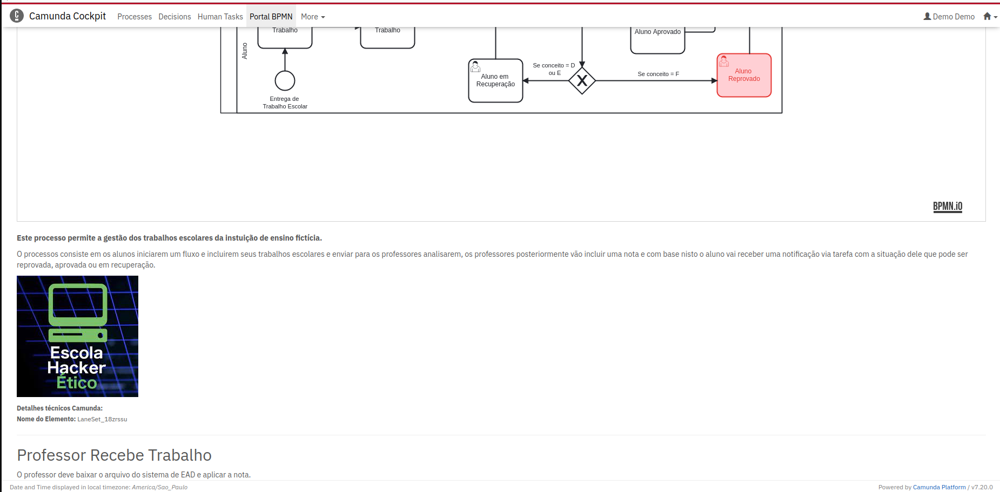

# Camunda Plugin for BPMN Documentation Portal

[-orange.svg>)](#)  [](https://opensource.org/licenses/Apache-2.0)

This project aims to build a process documentation portal integrated with Camunda BPM Platform software. For a full feature use should be used in conjunction with the Camunda Modeler Plugin WYSIWYG Documentation editor for Camunda Modeler

## Version Support.
This plugin has been approved and tested in version 7.20 of Camunda. Supported by all versions 7.20 or higher.

## Features.

- Features latest version of the camunda process with the description element and the HTML description complementary element.
- Visual navigation by clicking on the direct process for documentation.
- Integrated with Camunda Cockpit.
- Examples of Processes Documentation with WYSIWYG Documentation Editor for Camunda Modeler

## Camunda BPM Portal Screenshots.

## Portal Home.


## Visualization of a Process with Documentation.



## Process Documentation Details.


## Share globally (administrator).
Share access to documentation via **DELETE** and **CREATE** permissions


Access enabled for flows:
- Delivery of School Work
- Invoice Receipt
- the Sample Pizza Process
- Order Pizza
    
## Share globally (user).

Access to documentation with **READ** permission


List of shared flows.

## Installation (v0.3.0++).

### Apache Tomcat.

1. Realise the download of the plugin in the latest version of https://github.com/project-cade-unb/camunda-bpm-portal/releases example portal-documentation-v0.3.0.jar

2. Copy to Camunda Server library folder. /server/apache-tomcat-9.0.75/webapps/camunda/WEB-INF/lib

3. Set up a filter on your web.xml in /server/apache-tomcat-9.0.75/webapps/camunda/WEB-INF/


   ```
     <filter>
        <filter-name>HttpHeaderSecurity</filter-name>
        <filter-class>
            org.camunda.bpm.webapp.impl.security.filter.headersec.HttpHeaderSecurityFilter
        </filter-class>

        <init-param>
            <param-name>contentSecurityPolicyValue</param-name>
            <param-value>
          base-uri 'self';
          script-src $NONCE 'unsafe-eval' https: 'self' 'unsafe-inline' 'unsafe-hashes';
          script-src-attr 'unsafe-inline';
          style-src 'unsafe-inline' 'self';
          default-src 'self';
          img-src 'self' data:;
          block-all-mixed-content;
          form-action 'self';
          frame-ancestors 'none';
          object-src 'none';
          sandbox allow-forms allow-scripts allow-same-origin allow-popups allow-downloads;
        </param-value>
        </init-param>
    </filter>
```

4. Restart your Camunda Server

5. The BPMN Portal will appear in the Cockpit menus.

**ATTENTION** If you have version v0.2.0 of the 'Portal BPM Plugin' in your Camunda, it can be removed! The new version does not need config.js and fonts in the scripts in the app, etc! If you leave it, two menus will appear in the cockpit: Portal BPMN referring to v0.2.0 and Portal Documentation referring to V0.3.0+

### YouTube Iframe

To allow external requests to YouTube in your Camunda application, you will need to add a filter in Tomcat's `conf/web.xml` file. Follow these instructions:

1. Open the `conf/web.xml` file.
2. Add the following code to allow external requests:

  ```xml
    <filter>
        <filter-name>HttpHeaderSecurity</filter-name>
        <filter-class>org.camunda.bpm.webapp.impl.security.filter.headersec.HttpHeaderSecurityFilter</filter-class>

        <init-param>
            <param-name>contentSecurityPolicyValue</param-name>
            <param-value>
                base-uri 'self';
                default-src 'self' 'unsafe-inline';
                frame-src 'self' https://www.youtube-nocookie.com;
            </param-value>
        </init-param>
    </filter>
```

## Build (Developers).

```bash
git clone https://github.com/projeto-cade-unb/camunda-bpm-portal.git
cd camunda-bpm-portal
mvn clean install
```

## Roadmap.

### Improvements:

- UI: Add an action to show and hide the "Technical details" area, this information is not relevant for business users.

- UI: Add the thumbnail HTML Element type icon before the Element name.

- Versioning: Support for viewing process versioning (create a select to allow the user to select previous versions, always show the latest one as is by default)

- UI: Allow BPMN categorization for example HR, Financial, Commercial, etc.

- UI: Export to PDF or Doc.

## Contributions.

Send your contribution via pull request.
