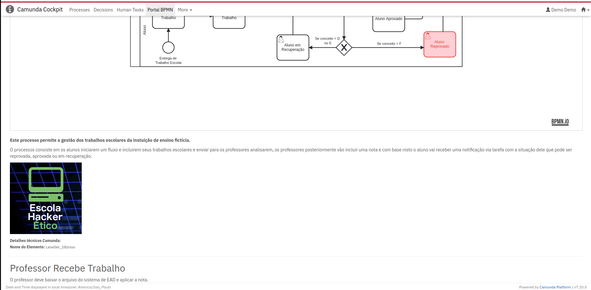

# Plugin Camunda para Portal de Documentação de BPMNs

[-orange.svg>)](#)  [](https://opensource.org/licenses/Apache-2.0)

Este projeto visa construir um portal de documentação de processos integrados ao software Camunda BPM Plataform.
Para um uso de todas funcionalidades deve ser usado em conjunto com o Plugin do Camunda Modeler [WYSIWYG Documentation editor for Camunda Modeler](https://github.com/sharedchains/camunda-wysiwyg-documentation)

## Suporte de Versões.

Este plugin foi homologado e testado na versão 7.20 do Camunda. Suportado por toda versões 7.20 ou superiores.

## Funcionalidades.

- Apresenta última versão do processo do camunda com o elemento description e o elemento complementar de descrição em HTML.
- Navegação visual ao clicar no processo direta para documentação.
- Integrado ao Camunda Cockpit.
- Exemplos de Processos documentados com [WYSIWYG Documentation editor for Camunda Modeler](https://github.com/sharedchains/camunda-wysiwyg-documentation)

## Telas do Camunda BPM Portal.

## Home do Portal.


## Visualização de um Processo com Documentação.



## Detalhamento da Documentação do Processo.


## Compartilhar globalmente (administrador).

Compartilha acesso a documentação pela permissão **DELETE** e **CREATE**


Acesso habilitado para os fluxos:

- Entrega de Trabalho Escolar 
- Invoice Receipt
- Sample Pizza Process
- Order Pizza

## Compartilhar globalmente (usuário).

Acesso a documentação pela permissão **READ**


Lista de fluxos compartilhados.

## Instalação (v0.3.0++).

### Apache Tomcat.

1. Realise o download o release do plugin na última versão de https://github.com/projeto-cade-unb/camunda-bpm-portal/releases
   exemplo portal-documentation-v0.3.0.jar

2. Copie para pasta de bibliotecas do Camunda Server.
   <instal-camunda-path>/server/apache-tomcat-9.0.75/webapps/camunda/WEB-INF/lib

3. Configure um filtro em seu web.xml em <instal-camunda-path>/server/apache-tomcat-9.0.75/webapps/camunda/WEB-INF/

  ```xml
     <filter>
        <filter-name>HttpHeaderSecurity</filter-name>
        <filter-class>
            org.camunda.bpm.webapp.impl.security.filter.headersec.HttpHeaderSecurityFilter
        </filter-class>

        <init-param>
            <param-name>contentSecurityPolicyValue</param-name>
            <param-value>
          base-uri 'self';
          script-src $NONCE 'unsafe-eval' https: 'self' 'unsafe-inline' 'unsafe-hashes';
          script-src-attr 'unsafe-inline';
          style-src 'unsafe-inline' 'self';
          default-src 'self';
          img-src 'self' data:;
          block-all-mixed-content;
          form-action 'self';
          frame-ancestors 'none';
          object-src 'none';
          sandbox allow-forms allow-scripts allow-same-origin allow-popups allow-downloads;
        </param-value>
        </init-param>
</filter>
```

4. Reinicie seu Camunda Server

5. O Portal BPMN aparecerá nos menus do Cockpit.

**ATENÇÃO** Caso tenha a versão v0.2.0 do 'Portal BPM Plugin' em seu Camunda, a mesma pode ser removida! A nova versão não precisa do config.js e fontes no scripts no app , etc! Se deixar aparecerá dois menus no cockpit: Portal BPMN referente a v0.2.0 e Portal Documentation referente a V0.3.0+

### Iframe do YouTube

Para permitir requisições externas ao YouTube em sua aplicação Camunda, você precisará adicionar um filtro no arquivo `conf/web.xml` do Tomcat. Siga as instruções:

1. Abra o arquivo `conf/web.xml`.
2. Adicione o seguinte código para permitir requisições externas:

   ```xml
    <filter>
        <filter-name>HttpHeaderSecurity</filter-name>
        <filter-class>org.camunda.bpm.webapp.impl.security.filter.headersec.HttpHeaderSecurityFilter</filter-class>

        <init-param>
            <param-name>contentSecurityPolicyValue</param-name>
            <param-value>
                base-uri 'self';
                default-src 'self' 'unsafe-inline';
                frame-src 'self' https://www.youtube-nocookie.com;
            </param-value>
        </init-param>
    </filter>
   ```

## Build (Desenvolvedores).

```bash
git clone https://github.com/projeto-cade-unb/camunda-bpm-portal.git
cd camunda-bpm-portal
mvn clean install
```

## Roadmap.

### Melhorias:

- UI: Colocar uma ação para apresentar e esconder a área "Technical details", estas informações não são relevantes para usuários de negócio.

- UI: Colocar o Icone do tipo de Element HTML miniatura antes do nome do Elemento.

- Versionamento: Suporte a visualizar versionamento de processos (criar um select para permitir o usuário selecionar versões anteriores , mostrar poir default sempre a última como está)

- UI: Permitir Categorização de BPMNs Exemplo RH , Financeiro, comercial, etc.

- UI: Exportação para PDF ou Doc.

## Contribuições.

Envie sua contribuição via pull request.
